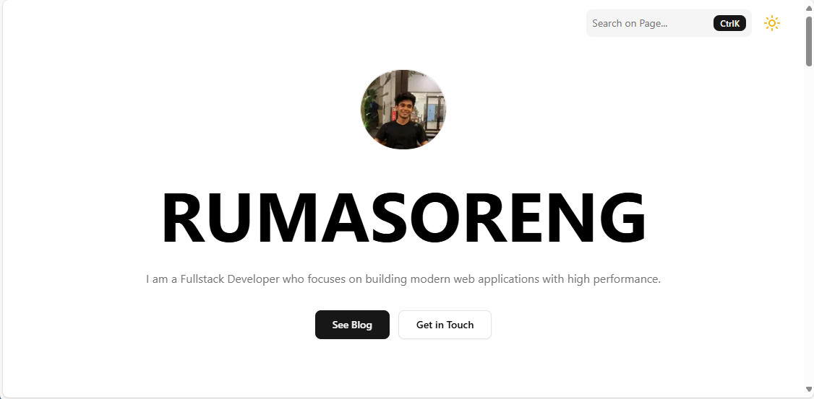

# 🌐 Next.js Modern Portfolio v1

[](https://github.com/RumasorengFadil/nextjs-modern-portofolio-v1/stargazers)
[](https://github.com/RumasorengFadil/nextjs-modern-portofolio-v1/network/members)
[](https://github.com/RumasorengFadil/nextjs-modern-portofolio-v1/issues)
[](./LICENSE)

🚀 **Next.js Modern Portfolio v1** is a **modern portfolio** template based on **Next.js 15 App Router**, **Tailwind CSS v4**, **Framer Motion**, and **ShadCN UI**.  
Suitable for **developers, freelancers, designers, and creators** who want to showcase their profile, projects, and experience with a **clean, responsive, and SEO-friendly** look.

---

## ✨ Key Features

- ⚡ **Next.js 14 App Router** → SSR/ISR for SEO & optimal performance
- 🎨 **Tailwind CSS v4 + ShadCN UI** → modern & easily customizable design  
- 🎬 **Framer Motion Animations** → interactive & smooth animations  
- 🌙 **Dark Mode Toggle** → dark/light mode support  
- 📂 **Blog Section (optional)** → showcase articles & technical posts  
- 📱 **Responsive** → looks perfect on all devices  

---

## 📸 Demo

🔗 **Live Demo:** [click here](https://www.rumasoreng.com/)  



---

## ⚙️ How to Install & Setup

Clone this repo and run it locally:

```bash
# Clone repository
git clone https://github.com/RumasorengFadil/nextjs-modern-portofolio-v1.git

# Enter the project folder
cd nextjs-modern-portofolio-v1

# Install dependencies
npm install

# Run the development server
npm run dev

Access at http://localhost:3000
```

## 💡 Use Cases

Use this repo if you want to:

Build a modern portfolio quickly

Showcase your profile, projects, and work experience

Create a personal landing page for developers/designers

Create an interactive, SEO-friendly online resume

## 🛠️ Tech Stack

Next.js 14

Laravel 10

Tailwind CSS v4

ShadCN UI

Framer Motion

Zustand

## 🤝 Contributing

Contributions are greatly appreciated!
If you find a bug or want to add a feature:

Fork this repo

Create a new branch (git checkout -b feature/feature_name)

Commit the changes (git commit -m “Add feature_name”)

Push the branch (git push origin feature/feature_name)

Create a Pull Request 🎉

## 📄 License

License: MIT License
– feel free to use, modify, and distribute.
– Don't forget to include the credit.

## ⭐ If this repo is useful, don't forget to star it to show your support!


---

I'd also like to add a **“Roadmap”** section (upcoming features) to give an overview of the project. 
